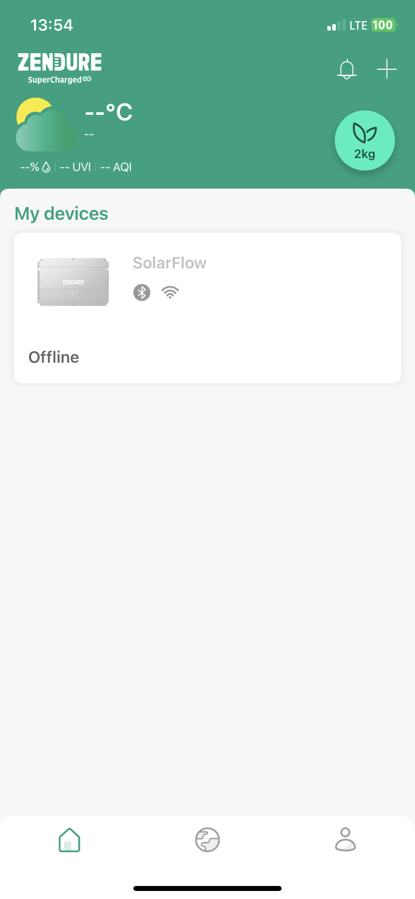
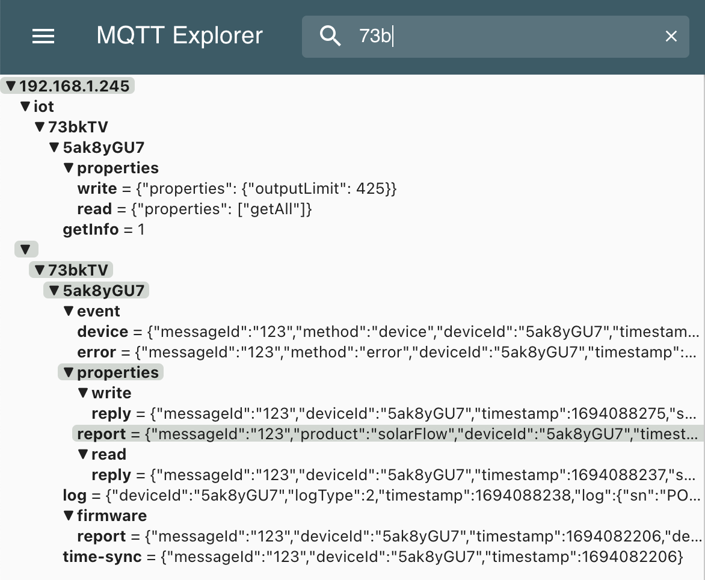
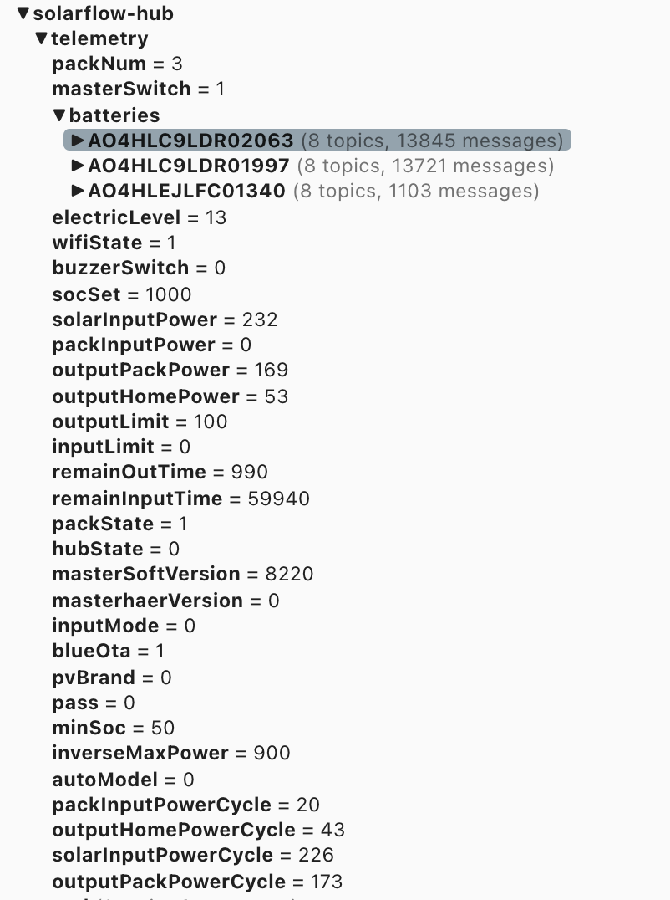

# Solarflow Bluetooth Manager
This is a little tool to connect to Zendure's Solarflow hub via bluetooth to retrieve telemetry data and to manage it's connection to a local MQTT broker or to the Zendure cloud.

> [!NOTE]
>
> Please note that this is work in progress. Completely use at you own risk.

1. [Features](#features)
1. [Why disconnect your Solarflow Hub](#why)
1. [How to use](#howto)
1. [Use Cases](#usecase)


## Features <a name="features"></a>
Currently you can:
- connect to the hub by using a BTLE (Bluetooth Low Energy) connection
- retrieve system information (Device ID, Serial No., Battery Pack information, general settings, ...)
- continously retrieve telemetry data and send it to a local MQTT broker
- disconnect the hub from Zendure's cloud broker and connect it to a local one (offline mode)
- reconnect the hub to Zendure's cloud broker

## Why disconnect your SF Hub from the cloud? <a name="why"></a>
That is a good question. A few reasons:
- if you want to gain more control over the hub. E.g. when implementing a custom output function that is not covered by the app or need more fine granular limiting.
- if you want to remove dependencies to the cloud service and/or are in a isolated environment or want to avoid roundtrip times.
- if you want to keep your usage data completely local
- if you want to easier integrate with your home automation system
- if you want to have a standalone Solarflow status page (see [Solarflow Statuspage](https://github.com/reinhard-brandstaedter/solarflow-statuspage))
- ...


## How to use <a name="howto"></a>
You will need a Bluetooth LE capable system with Python 3. E.g. a Raspberry Pi (Zero) with Linux or any other OS (Windows should also work).
The script is searching for a Zendure Device with a Bluetooth name that starts with "Zen". E.g. my hub is named "Zen1_P38". I'm not certain if other Zendure devices in range might interfere with that. It will try to connect to the first one.

### Operating Modes
There are two ways how you can leverage the BT Manger to operate your Solarflow Hub:

- offline mode
- proxy mode

#### Offline Mode
The offline mode means you take your SF Hub completely offline - well it will still be in your WiFi network, but it will not talk to Zendure's Cloud service at all.
For this mode you just use this tool to disconnect the hub and have it report data to your own MQTT broker in your local network.
Once the hub is disconnected it will report all data just as if it would be talking to Zendure's cloud service.

You will not be able to see any telemetry data in the mobile app. And you won't be able to control the hub via the app or any server-side schedules.
All setting changes will be needed to be performed locally via the correct MQTT messages sent to the correct topics.

Once you take your hub offline nothing needs to run locally except your own MQTT broker.



#### Proxy Mode
The proxy mode means your SF Hub will still report some device data to Zendure's cloud but no live telemetry data. You would still see your hub in the mobile app and you will be able to control it via the mobile app and schedules should also work.

To gather telemetry data you will need to run the BT manager tool as a service on a BT-enabled device (such as a Raspberry Pi) within range of your hub. The BT manager will continously collect telemetry data and report it to MQTT for you.

*Note:* I've been using this mode for some time and it worked mostly flawless. From time to time I had the bluetooth connection drop (using a Raspberry Pi Zero W) and it wouldn't reconnect to the hub. I either had to force drop the BT connection on the RasPi or on the hub by briefly diconnecting it from the WiFi (kickin it out of my Access Point) 

### Getting Basic Information
To get basic information about the hub (without performing any changes) run the script with the -i option only:

```
$ python3 solarflow-bt-manager.py -i
```

After a successful connection you should see some output like this. You will also start seeing lots of JSON output with other device details. Also the divice will start reporting telemetry data. After a few seconds the script will terminate.

```
2023-09-05 13:52:27,534:INFO: Found device: 94:C9:60:3E:C8:E7: ZenP1_38
2023-09-05 13:52:28,393:INFO: Services:
2023-09-05 13:52:28,397:INFO: 00112233-4455-6677-8899-aabbccddeeff (Handle: 18): Unknown
2023-09-05 13:52:28,402:INFO: 0000a002-0000-1000-8000-00805f9b34fb (Handle: 12): Vendor specific
2023-09-05 13:52:28,409:INFO: 00001801-0000-1000-8000-00805f9b34fb (Handle: 1): Generic Attribute Profile
...
2023-09-05 13:52:28,682:INFO: The SF device ID is: 5ak8yGU7
2023-09-05 13:52:28,684:INFO: The SF device SN is: PO1HLC9LDR01938
```

Take a note of the device hardware address, the device ID, and the serial number, you might need that later.

### Report telemetry to a local MQTT
To continously start reporting telemetry data to a local MQTT broker you can start the script with the -b option. (note: no user authentication for MQTT implemented yet).

```
$ python3 solarflow-bt-manager.py -i -b 192.168.1.245
```

Once the Bluetooth connection is established telemetry data will be published to the root topic ```solarflow-hub/telemetry```.
You can use that data for any other integration (e.g. Homeautomation systems etc.).
E.g. my [Solarflow Statuspage](https://github.com/reinhard-brandstaedter/solarflow-statuspage) is now also using this data instead of the cloud data.

> [!NOTE]
> While the bluetooth connection is enabled, the hub ONLY reports telemetry via BT! There will be no data sent in parallel to the Zendure Cloud broker. As a consequence you will not see any data in the mobile app. You can still control the hub though via the app. 

### Disconnecting the hub from the cloud
You can completely disconnect the hub from the Zendure cloud and have it report to a local MQTT broker. It will then not send any data to the cloud but you will also not be able to change any settings with the app. From that point on you can only control the hub via your local MQTT broker. This gives you full control but is for advanced usage (e.g. setting the output limit to any arbitrary value)

> [!NOTE]
> I've tested this setup and I'm currently using it for some time. Use at your own risk! Longterm experience (firmware upgrades etc.) will show how this works over time.

Disconnecting works by reinitializing the hubs network connection (WiFi) and telling the hub to connect to a different MQTT broker.
(eventually you need to change the WiFi first to another network before joining the target network)

```
$ export WIFI_PWD="your_wifi_password"
$ export SF_DEVICE_ID="your_sf_deviceid"
$ python3 solarflow-bt-manager.py -d -w <WiFi SSID> -b <local MQTT broker>
```

This will - if successful - tell the hub to disconnect and reconnect the WiFi and then start sendin data to your local MQTT broker. Unfortunately it will use the hubs default (hardcoded?) password. So you will (for now hopefully) set your MQTT broker to accept any login (remove authentication).
After some time you should see topics populated in your broker. You should see a topic similar like this ```/73bkTV/<your device id>/#```



#### Prettyfying Zendure's MQTT topics
The hub will report data like in the screenshot above. To align this with the structure the proxy-mode and the statuspage uses I've also added a little prettyfier tool that (run as a service) will process the original MQTT topics and publish them in an easier readable format.
You can find that tool '''solarflow-topic-manager.py''' [here](src/solarflow-topic-mapper.py). Run it as a service or docker container.



### Reconnecting the hub to the cloud
Yoy can reconnect to hub back to Zendure's cloud again. This might be necessary to get firmware updates. The process is similar to the disconnect steps:

```
$ export WIFI_PWD="your_wifi_password"
$ export SF_DEVICE_ID="your_sf_deviceid"
$ python3 solarflow-bt-manager.py -c -w <WiFi SSID>
```

## Use Cases <a name="usecase"></a>

### Dynamic Limiting

### Charting


## Donations
If you are happy with the solarflow tools I created and it helps you, I'm happy to take donations so that in the case of destroying my only Solarflow system while hacking on the internals I can afford a new one :-)

[](https://www.paypal.com/cgi-bin/webscr?cmd=_s-xclick&hosted_button_id=RUZP3LCKH56CU)
